# :brazil: Nuvem de Palavras dos Candidatos à Presidência

Ano de eleição, ano de um monte de texto com os planos de governo - com a formalização das promessas, diretrizes e metas de cada chapa candidata.

Inspirada numa [matéria](https://g1.globo.com/politica/eleicoes/2018/noticia/2018/08/17/o-que-dizem-os-programas-de-governo-dos-candidatos-a-presidencia.ghtml) publicada na cobertura especial das Eleições do Portal G1, aqui estão as nuvens de palavras dos planos de governo dos candidatos à Presidência da República, criadas utilizando Python + [Jupyter Notebook](http://jupyter.org/) + [textract](https://textract.readthedocs.io/en/stable/).

Foi gerada também uma nuvem de palavras *geral*, que consiste na união do texto dos planos de governo de todos os candidatos. 

Todos os documentos foram retirados diretamente do site oficial da campanha das chapas.

## **Nuvem de Palavras Geral**
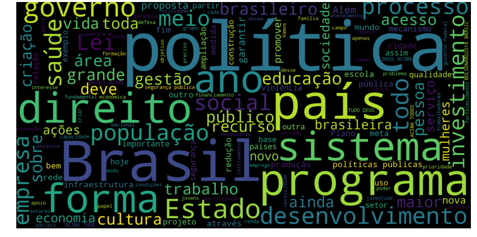

## **Nuvem de Palavras dos Candidatos (em ordem alfabética)**

### Álvaro Dias (Podemos)
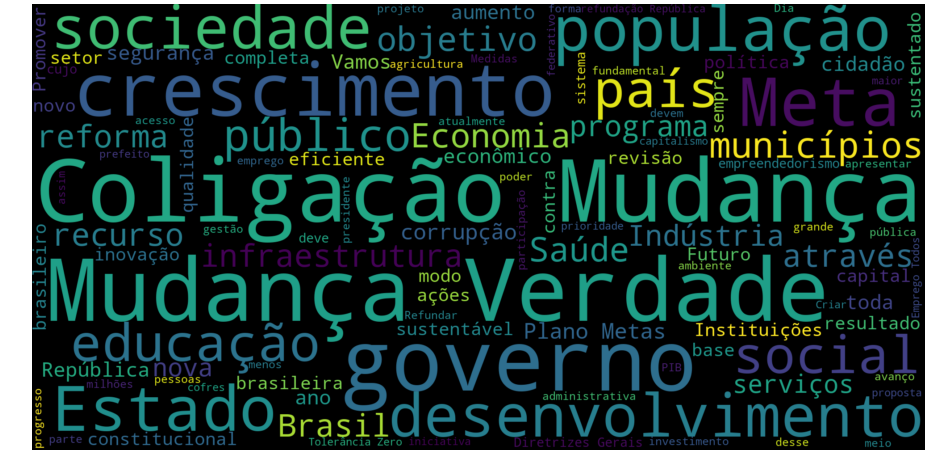

### Cabo Daciolo (Patriota)
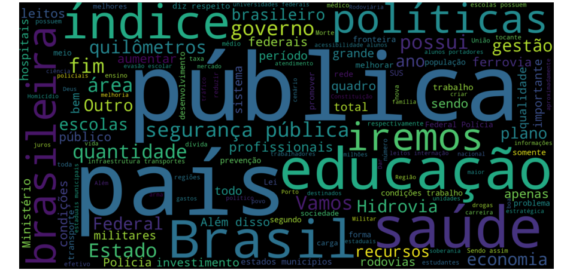

### Ciro Gomes (PDT)
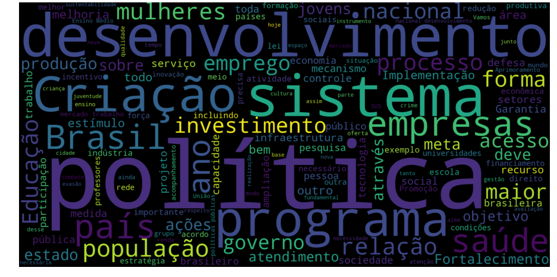

### Geraldo Alckmin (PSDB)
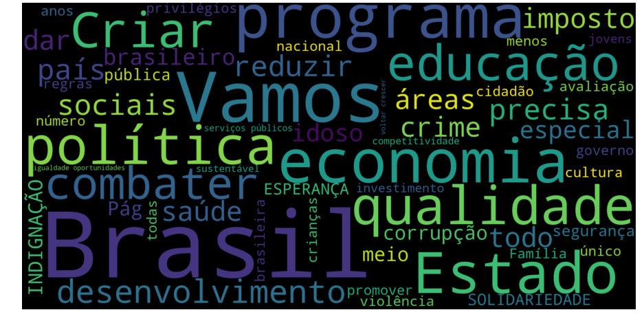

### Guilherme Boulos (PSOL)
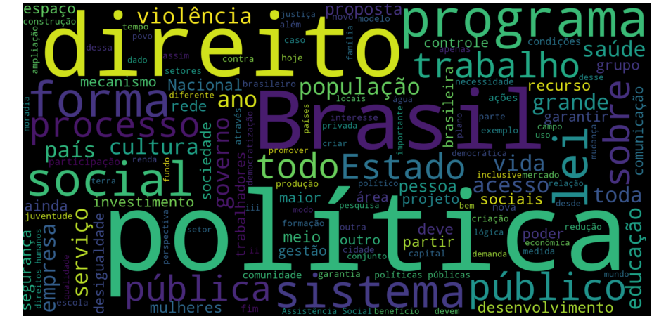

### Jair Bolsonaro (PSL)
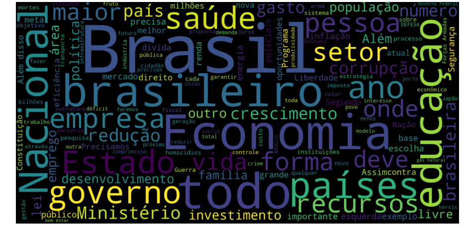

### João Amoêdo (Novo)
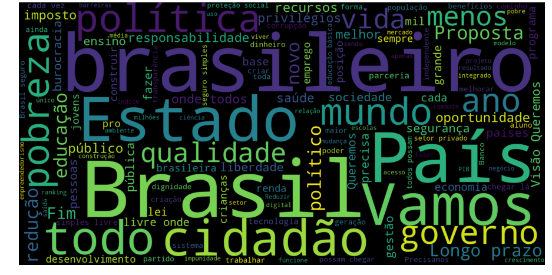

### José Maria Eymael (DC)
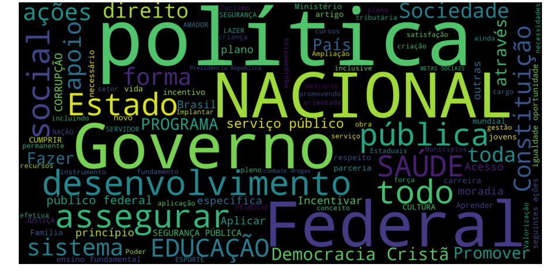

### Lula (PT)
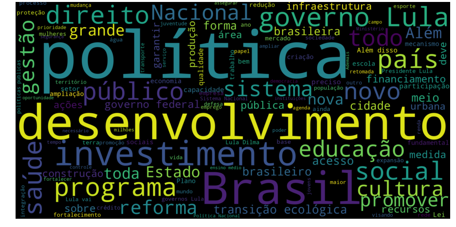

### Marina Silva (Rede)
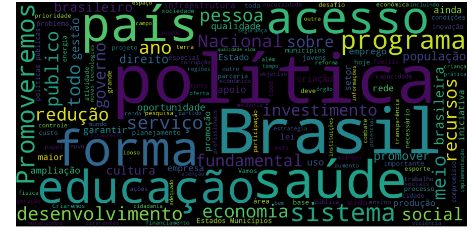

### Vera Lúcia (PSTU)
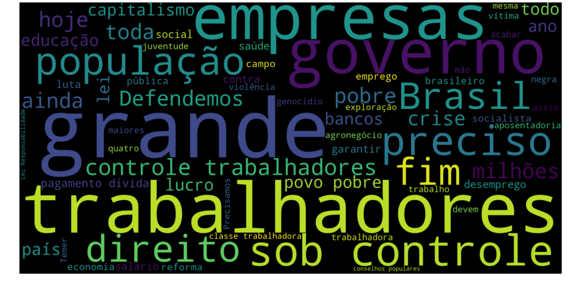
